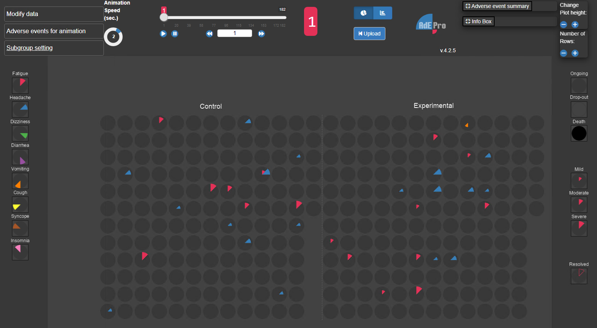
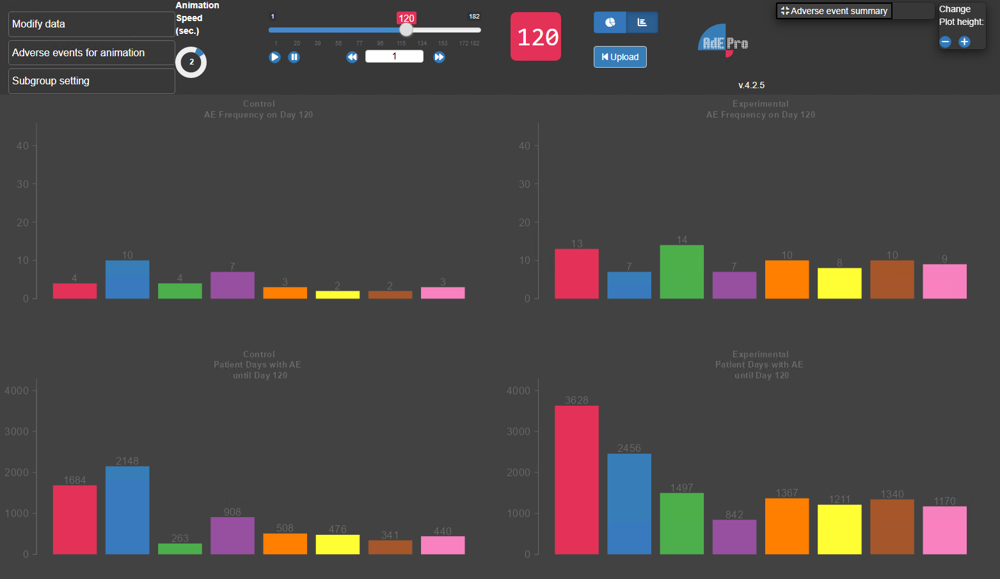
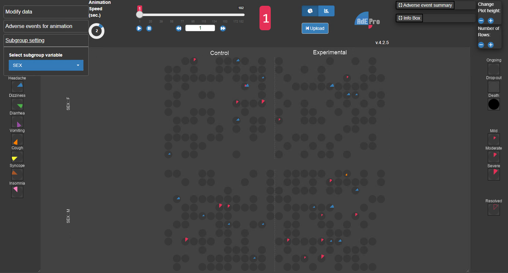

<!-- README.md is generated from README.Rmd. Please edit that file -->

```{r, include = FALSE}
  knitr::opts_chunk$set(
    collapse = TRUE,
    comment = "#>",
    fig.path = "man/figures/README-",
    out.width = "100%"
)
```

# AdEPro 

<!-- badges: start -->
[](https://cran.r-project.org/package=adepro) 
[](https://cranlogs.r-pkg.org/badges/grand-total/adepro)
[](https://www.repostatus.org/#active)
<!-- badges: end -->

AdEPro (Animation of Adverse Event Profiles) is a Shiny application for the (audio-)visualization of adverse events during clinical trials. AdEPro allows the user to upload the clinical trial data using the typical Analysis Data Model (**ADaM**) in Clinical Data Interchange Standards (**CDISC**). For this, just upload the adverse event dataset (**ADAE**) to AdEPro by means of the Upload Data panel, either as a sas7bdat file or as comma-separated values (csv).

## Description

The database in a clinical trial contains vast information on **adverse events**, involving hundreds of different adverse event terms with varying severity grades and different start and end dates. Despite this plethora of information, insight into adverse events in a clinical study is usually limited to simple summary tables of absolute and relative numbers of adverse event occurrences. **AdEPro**, an innovation of Bayer's Biostatistics Innovation Center, is an unparalleled approach to **audio-visualize** the safety profile of both the individual patient and the entire study cohort, which enables every study team member to experience the study and empathize with the patients.

The AdEPro Shiny app depicts the **temporal progress of all adverse events in every study subject** and enables the user to give profound answers to complex questions surrounding adverse events such as the **frequency, duration and correlation** of adverse events of interest. The incorporated sound component stresses changes in the adverse event profile of the study.

Additionally, to keep an overview of even **large trials** (\>500 patients), intelligent sorting algorithms under the name of '**AdEPro AI**' (based on seriation techniques from the seriation package by Hahsler [[1]](#lit1)) allow to sort the patients in a way that **patients with similar adverse event profiles are close to one another** and relevant differences between the treatment groups regarding the displayed adverse events remain recognizable at first sight.

As an alternative to the patient-by-patient 'circle view', an aggregated "**barplot view**" is implemented which displays the **aggregated numbers of subjects with adverse events**. This can be especially helpful in case the numbers are too great to be easily counted.

## Getting Started

The R-package AdEPro is available on CRAN as well as on Github and may be installed using

```{r, eval = FALSE}
install.packages("adepro")
```

or

```{r, eval = FALSE}
install_github("Bayer-Group/BIC-AdEPro")
```

respectively.

After installation AdePro can be started using

```{r, eval = FALSE}
library(adepro)
launch_adepro()
```

The application will start showing the data upload page. For detailed information on how to upload data, see section [Functionality](#Functionality).

## Surface



Via the "Change View" button, the display can be switched from "circle view" to "barplot view" and back.


In the "circle view", every circle represents one subject. Each **slice** inside a circle represents a different **adverse event**, color-coded according to the legend on the hand side. As indicated in the legend on the right side, the **size of the slices indicates the intensity** of the respective adverse event. **Framed unfilled slices** indicate adverse events which the patient experienced at a previous time in the study, but are no longer ongoing.
By clicking a single circle in the plot, the subject will be displayed as highlighted.
It is also possible to highlight all subjects with a specific adverse events by selecting the event
in the legend on the left side.
To remove the selection simply click the adverse event or subject selected again.


The background color of the circles shows the subject's status:  

| <!-- --> |<!-- --> |
|:------------------------------------:|:------------------------------------|
|  | A circle with **dark grey** background represents an enrolled subject |
|  | A circle with **light grey** background indicates discontinuation |
|  | A circle with **black** background indicates death |
| <!-- --> |<!-- --> |

The '**barplot view**' displays the aggregated numbers for the selected adverse events



The top bar of the app includes several other options which are further explained under [Functionality](#Functionality).

## Functionality


Select adverse event and subject level data on the left-hand side of the **Upload Data** page (start page) and '**submit**.' For more information on the required data structure see [Input Data](#input-data).


Should the plot size of the app not fit the screen size, the appearance of the app can be altered. The plot height can be changed using the '**Choose Plot height (in pixel)**'-option in the '**Modify data**' panel on the left-hand side or by clicking the '+' or '-' buttons of the '**Change Plot height**'-panel on the right-hand side. Similarly, the number of rows can be either changed in the '**Modify data**' panel ('**Number of Rows**') or using the '**Number of rows'-panel**. 
The  '**Modify data**' panel also includes options to '**Select type of Adverse Event**' (such as serious or study drug-related), '**Sort patients by**' a variable of your choosing and '**Sort treatments**'.
If the button '**Add AdEPro AI**' is selected, additional intelligent sorting algorithms are offered for use. For more information on this, please see [AdEPro AI](#adepro-ai).

The **timeline slider** in the top bar indicates the day of the study that is currently displayed. It can be moved manually or played automatically by using the navigation buttons underneath. The number of days by which the slider is moved by using the forward or backward button can be adjusted by changing the number in between. To the left of the timeline slider is a circular slider to set the '**Animation speed (sec.)**'.


The '**Adverse Events for animation**' panel on the lower left offers additional setting options. Per default, the eight events with most patient days are displayed. Other events can be selected using the '**Choose Adverse Events for display (max. 12)**' option or the '**frequency**' option can be used to display the eight most frequent events.

Via '**Choose Adverse Event for audio**' one specific adverse event can be selected to be rendered audible for up to two treatment groups that have to be selected via the '**Choose Treatment Group for first sound**' and '**Choose Treatment Group for second sound**' options. This activates a sound corresponding to the frequency of the selected event. The sound represents a categorized and normalized frequency grade of the chosen adverse event given the size of the treatment group and the overall frequency of this adverse event. There are four different types of sounds. The deepest sound signals that no adverse event has occurred in the selected group. The other three sounds increase in pitch level symbolizing equidistant increases in adverse event frequency. A sound will only be audible if there is a change in frequency grading in any of the treatment groups of the study.

The '**Subgroup Setting**' panel can be used to split the plot vertically by a subgroup variable in addition to the horizontal split by treatment.



## Input Data

AdEPro allows the user to upload the clinical trial data using the standard Analysis Data Model (**ADaM**) in Clinical Data Interchange Standards (**CDISC**). For this, just upload the adverse event dataset (**ADAE**) to AdEPro by means of the '**Upload Adverse Event Data**' option on the Upload page (start page).\
In case the ADAE dataset is not complete (i.e., patients without any adverse events are excluded), there is also an option to '**Upload Subject Level Data**' (ADSL) with complete subject information for all patients in the safety analysis set. Both datasets should be in sas7bdat- or csv-format.

Please ensure that your datasets contain all the **required variables**.

| Variable                            | Default                             | Format     | Notes                                                                        |
|:------------------------------------|:------------------------------------|:-----------|:-----------------------------------------------------------------------------|
| Subject Identifier                  | SUBJIDN; SUBJID; USUBJIDN; USUBJID  | num / char | Necessary for all uploaded data sets.                                        |
| Dictionary Derived Term             | AEDECOD                             | char       |                                                                              |
| Actual Treatment                    | TRT01A; TRT01AN; TRT01P; TRT01PN    | num / char |                                                                              |
| Date of First Exposure to Treatment | TRTSDT                              | char       |  Character Format: %Y-%m-%d                                                  |
| Date of Last Visit                  | LVDT                                | char       |  Character Format: %Y-%m-%d                                                  |
| Treatment Emergent Analysis Flag    | AETREMN; AETRTEM; TRTEMFLN; TRTEMFL | num / char | Expected values: '1', 'Y', 'Yes', 'YES', 'yes', 'y'                          |
| Safety Population Flag              | SAFFN; SAFFL                        | num / char | Expected values: '1', 'Y', 'Yes', 'YES', 'yes', 'y'                          |
| Adverse Event Start Day             | AESTDY; ASTDY                       | num        |                                                                              |
| Adverse Event End Day               | AEENDY; AENDY                       | num        |                                                                              |
| Severity / Intensity                | AESEVN; AESEV                       | num / char | Expected values: numeric (1, 2, 3), character ("MILD", "MODERATE", "SEVERE") |

Some variables which allow categorization of adverse events are '**Optional variables**' and do not necessarily need to be included.

| Variable                          | Default           | Format     | Notes                                                |
|:----------------------------------|:------------------|:-----------|:-----------------------------------------------------|
| Date of Death                     | DTHDT             | char       | Character Format: %Y-%m-%d                           |
| Serious Event Flag                | AESERN; AESER     | num / char | Expected values: '0', 'N', 'No', 'NO', 'no', 'n', '' |
| Causality Flag                    | AERELN; AEREL     | num / char | Expected values: '1', 'Y', 'Yes', 'YES', 'yes', 'y'  |
| Causality to Protocol Procedure   | AERELPRN; AERELPR | num / char | Expected values: '1', 'Y', 'Yes', 'YES', 'yes', 'y'  |
| Action Taken with Study Treatment | AEACNN; AEACN     | num / char | Expected values: '1', 'DRUG WITHDRAWN'               |

You may select other than the proposed default variables via drop down menus.

Further optional variables can be attached to ADAE (if not yet included) to enable sorting of the patients in the 'circle view'. These must be included in ADSL as well, if the decision is made to upload this dataset, but do not need to be specified via drop-down menus. The following variables just serve as some examples:

-   Sex (e.g. SEXN)

-   Race (e.g. RACEN)

-   Region (e.g. CNTYGR1N)

-   (other baseline variables)

## AdEPro AI

Animation of Adverse Event Profiles with Artificial Intelligence (in short **AdEPro AI**) is a feature of AdEPro which allows a column-wise sorting of patients according to similarities in their adverse event patterns to facilitate an easier and more harmonious overview of the complete adverse event data. To use AdEPro AI select '**Add AdEPro AI**' in the '**Modify data**' panel.

Euclidean distances between subjects are calculated based on patient days under specific adverse events. Per default, the eight most frequent adverse event variables are selected as **sequencing input**. These variables can also be further differentiated by severity grade (i.e., as patient days under a specific adverse event with a specific severity). However, the user may also select a completely different set of variables via the '**Sequencing input**' option.

The sequence and allocation of the patients in the graphic display results from following a seriation technique available in the seriation package by Hahsler and can be chosen via the '**Sequencing method**' option:

-   Gruvaeus Wainer heuristic with average linkage (GW_average)

-   Gruvaeus Wainer heuristic with complete linkage (GW_complete)

-   Gruvaeus Wainer heuristic with single linkage (GW_single)

-   Gruvaeus Wainer heuristic with Ward linkage (GW_ward)

-   Optimal Leaf Ordering with average linkage (OLO_average)

-   Optimal Leaf Ordering with complete linkage (OLO_complete)

-   Optimal Leaf Ordering with single linkage (OLO_single)

-   Optimal Leaf Ordering with with Ward linkage (OLO_ward)

-   Traveling Salesperson Problem (TSP)

-   Visual Assessment of Tendency (VAT)

## Additional information

Please make sure to use a platform with an audio player to make full use of all functionalities of AdEPro.

A publication with complete details on AdEPro can be found in Mentenich et al. (2020) [[2]](#lit2).

A video for a quick introduction to AdEPro is available under: <https://youtu.be/SumXdcOOrjA>.

## References

<a id="lit1">[1]</a> 
Hahsler, M., Buchta, C. & Hornik, K. (2024): '*seriation: Infrastructure for Ordering Objects Using Seriation*'. R package version 1.5.5, (<https://CRAN.R-project.org/package=seriation>).

<a id="lit2">[2]</a>
Mentenich, N., Tasto, C. & Becker, B. (2020): '*AdEPro: Animation of Adverse Event Profiles---Presentation of an Easy-to-Use App for Visually Exploring Individual Study Data*', Therapeutic Innovation & Regulatory Science volume 54, pages 1512--1521 (<https://link.springer.com/article/10.1007/s43441-020-00178-4>)

## Code of Conduct
  
Please note that the adepro project is released with a [Contributor Code of Conduct](https://contributor-covenant.org/version/2/1/CODE_OF_CONDUCT.html). By contributing to this project, you agree to abide by its terms.

## About

You are reading the doc about version : `r golem::pkg_version()`

This README has been compiled on the

```{r}
Sys.time()
```

Here are the tests results and package coverage:

```{r, error = TRUE}
devtools::check(quiet = TRUE)
```

```{r echo = FALSE}
unloadNamespace("adepro")
```

```{r, error = TRUE}
covr::package_coverage()
```
